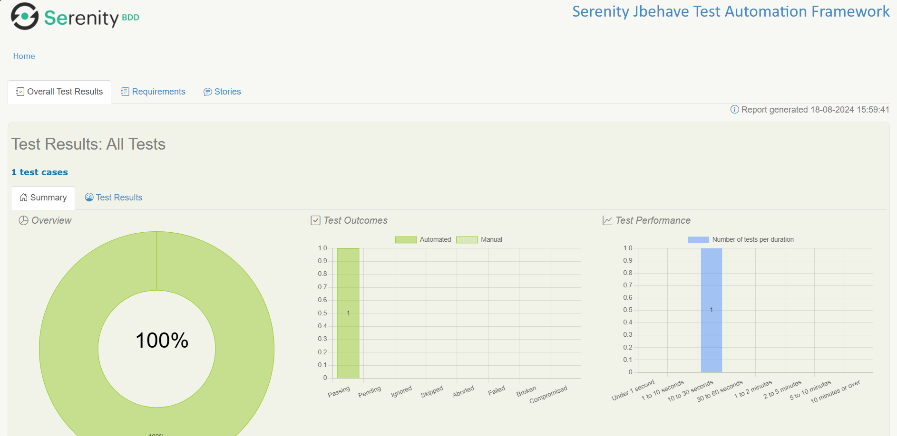
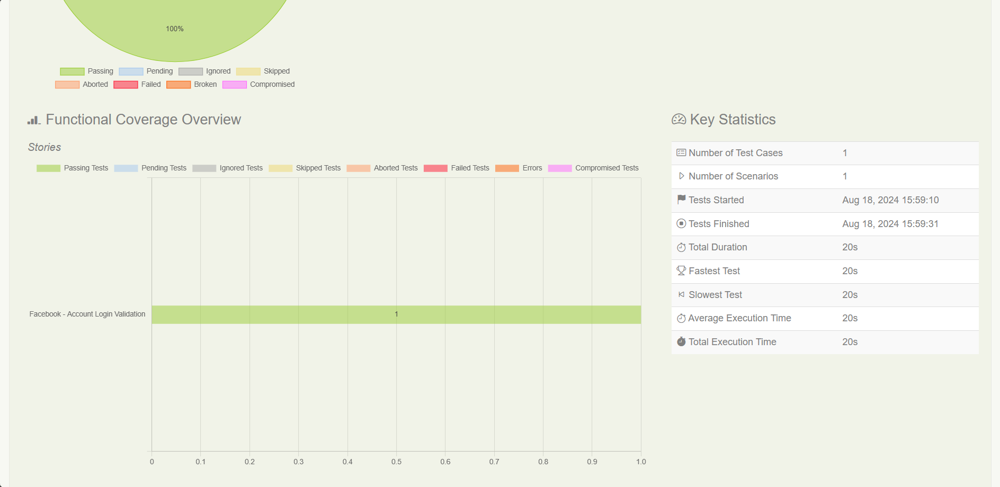
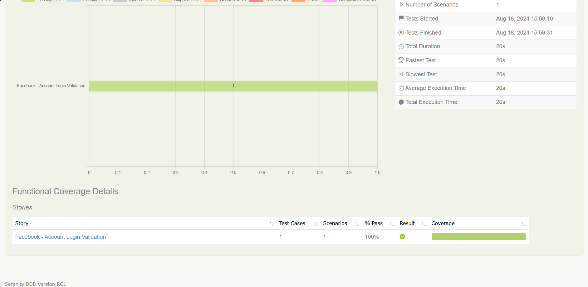
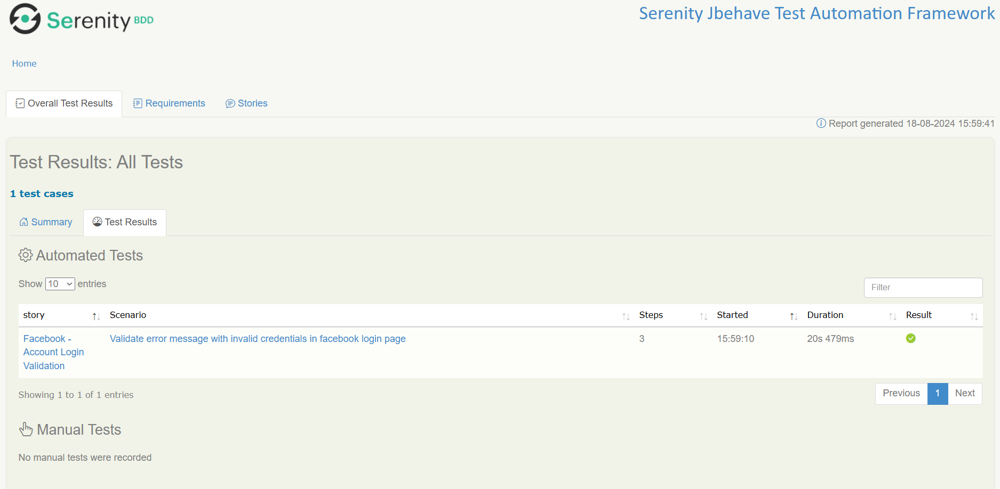
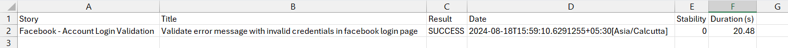

SERENITY JBEHAVE TEST AUTOMATION FRAMEWORK

# Maven Command to Execute Jbehave Story File:
- mvn verify "-Dmetafilter=groovy: scenario == 'scenario_name'" -DexecutionThreadCount=1 -f C:\Users\PathToFolder\pom.xml

# Framework Setup:
- Java 17
- Intellij 
- Maven 
- Jbehave Support Plugin 
- Chrome Driver (Browser Version)

# Test Output:

- target/site/serenity/index.html

- target/site/serenity/results.csv

 

